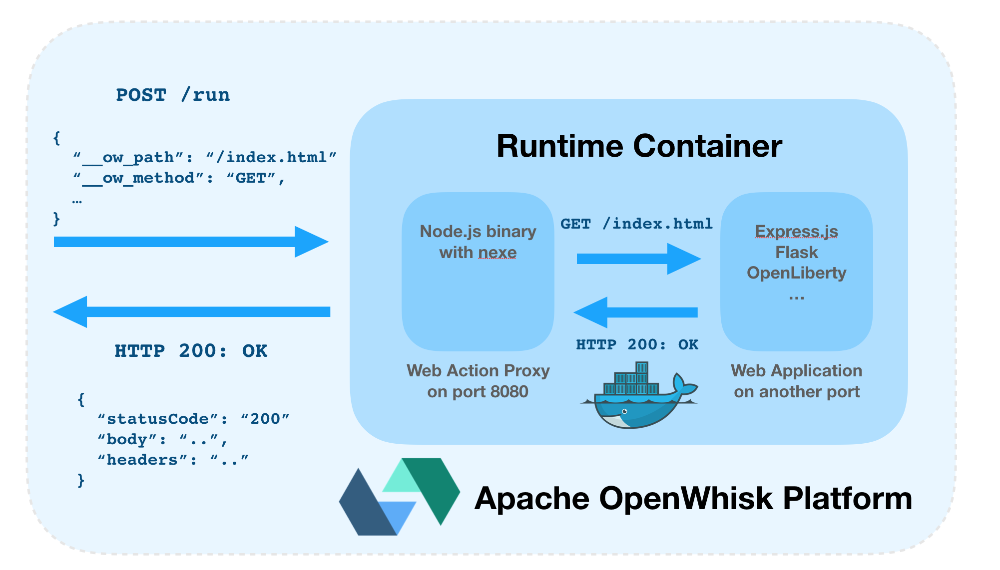

# Apache OpenWhisk Web Action HTTP Proxy

This project proxies HTTP traffic from [Apache OpenWhisk](http://openwhisk.incubator.apache.org/) [Web Actions](https://github.com/apache/incubator-openwhisk/blob/master/docs/webactions.md) to existing web applications.

[HTTP events](https://github.com/apache/incubator-openwhisk/blob/master/docs/webactions.md#http-context) received by the Web Action Proxy are forwarded as HTTP requests to the web application. HTTP responses from the web application are returned as Web Action [responses](https://github.com/apache/incubator-openwhisk/blob/master/docs/webactions.md#handling-http-requests-with-actions).

This proxy is designed to be built into a Docker image that will run the stateless web applications. Using [Docker support](https://github.com/apache/incubator-openwhisk/blob/master/docs/actions-docker.md) in Apache OpenWhisk, web applications can then be executed on the serverless platform with minimal modifications.



_**Please note: This is an alpha-stage experiment!** Don't expect everything to work. This project is designed to run small simple stateless web applications on Apache OpenWhisk. Please don't attempt to "lift 'n' shift" a huge stateful enterprise app server onto the platform!_

## Why?

There are lots of existing (simple) stateless web applications that could easily be ran on a serverless platform. People have already written a [number](https://github.com/IBM/expressjs-openwhisk) [of](https://github.com/claudiajs/claudia) [custom](https://github.com/logandk/serverless-wsgi) [plugins](https://github.com/Miserlou/Zappa) for web application frameworks to support running those framework applications on serverless platforms.

These projects allow developers to continue to use frameworks they are familiar when building serverless web applications and provide an easy path to "lift and shift" existing web applications to serverless platforms.

Using framework plugins as the approach, to allowing web application to run on serverless platforms, needs the same custom proxy plugin re-implemented for every different framework. This project provides a mechanism, using an external HTTP proxy process, to support any existing web application without needing a custom framework plugin.

## Runtime Mode Options

The proxy binary needs to be executed in a Docker container alongside the web application process.

Both HTTP processes must be started on different ports. The proxy uses port 8080 and the web application can use any other port. An environment variable or action parameter can be used to configure the local port to proxy.

Two  different options are available for getting web application source files into the runtime environment.

- **[Build source files directly into the container image alongside proxy binary.](#usage-sources-files-in-image)**
- **[Dynamically inject source files into container runtime during initialisation.](#usage-dynamic-runtime-injection)**

Building source files into the container is simpler and incurs lower cold-starts delays, but means source code will be publicly available on Docker Hub. Injecting source files through the action zips means the public container image can exclude all private source files and secrets. The extra initialisation time for dynamic injection does add to cold-start delays.

## Configuration

HTTP proxy options can be defined using environment variables (defined in Dockerfiles) or default action parameters. The following configuration options are supported.

### environment variables

- `PROXY_HOST` - host to proxy (default: `localhost`).
- `PROXY_PORT` - local port used by the web application (default: `80`).
- `PROXY_ALIVE_PATH` - URL path to check for `200` response indicating server is available (default: `/`).
- `PROXY_ALIVE_DELAY`- poll delay (ms) in between liveness checks (default: `100`)
- `PROXY_PROTOCOL` - protocol prefix used in proxy requests (default: `http`)

### action parameters

- `__ow_proxy_host` - host to proxy (default: `localhost`).
- `__ow_proxy_port` - local port used by the web application (default: `80`).
- `__ow_proxy_alive_path` - URL path to check for `200` response when server is available (default: `/`).
- `__ow_proxy_alive_delay`- poll delay (ms) in between liveness checks (default: `100`)
- `__ow_proxy_protocol` - protocol prefix used in proxy requests (default: `http`)
- `__ow_proxy_env_<ENV_VAR_NAME>` - set custom environment variable in runtime.

*note: the web application cannot use port 8080 as this is used by the proxy to expose the runtime API.* 

## Usage (Dynamic Runtime Injection)

Dynamic runtime injection needs you to build a Docker image containing just the proxy binary and runtime dependencies. Application source files are provided in the action zip file and extracted into the runtime upon initialisation. The proxy will start the app server on the first request.

### define custom docker image

This image should contain just the proxy binary and necessary dependencies (e.g node.js runtime).

```
FROM image:version

ADD proxy /app/
WORKDIR /app
EXPOSE 8080

CMD ./proxy
```

The Dockerfile must have the following commands.

- `COPY/ADD proxy <dest>` - Add the proxy binary from this project to the runtime filesystem 
- `EXPOSE 8080` - Expose the proxy port used to handle requests from the platform.
- `CMD ./proxy` - Starts HTTP proxy process to handle platform requests.

*Environment variables can also be defined here to set proxy configuration options, instead of using default action parameters as shown below.*

### build custom docker image

- Run the Docker build command to create a new image.

```
docker build -t <REPO>/<IMAGE> .
```

- Push the image to a public Docker Hub repository.

```
docker push <REPO>/<IMAGE>
```

*Using Docker images in Apache OpenWhisk needs those images to be available on Docker Hub. Private container registries are not currently supported in the platform.*

### use image with openwhisk web actions

- Bundle application source files into a zip file.

```
zip -r action.zip *
```

- Create the Web Action from the Docker image with the following command.
  - Replace `<START_COMMAND>` with the command needed to start the web application server.
  - Replace `<PROXY_PORT>` with the port used by the web application server.
  - Replace `<ACTION_NAME>` with an action name.

```
wsk action create --docker <REPO>/<IMAGE> --web true --main "<START_COMMAND>" -p "__ow_proxy_port" <PROXY_PORT> <ACTION_NAME> action.zip
```

- Retrieve the Web Action URL for the new action.

```
wsk action get <ACTION_NAME> --url
```

### invoke the web action

Web Action URLs are in this format.

```
https://<OW_HOST>/api/v1/web/<NAMESPACE>/default/<ACTION_NAME>/
```

Invoking these URLs with HTTP requests will proxy the web application from inside the container.

Requests to the base Web Action URL will be treated as requests to the URL root for the web application. Subpaths requests on the base Web Action URL will be forwarded as sub-paths to the web application.

## Usage (Sources Files In Image)

With an existing Docker image containing application runtime and source files, you can just extend the image with extra commands as shown below.

### from an existing web app image

```
FROM app_runtime:version

ENV PROXY_PORT 5000
COPY proxy /app
EXPOSE 8080

CMD ./app/script.sh
```

The Dockerfile used to build the runtime image must have the following commands.

- `ENV PROXY_PORT <LOCAL_PORT>` - Sets the local port used by the web application to proxy.

- `COPY/ADD proxy <dest>` - Add the proxy binary from this project to the runtime filesystem 
- `EXPOSE 8080` - Expose the proxy port used to handle requests from the platform.

The `CMD` for the image should start both processes in the foreground. This can be achieved using a bash script as follows.

```
#!/bin/bash

./<PROXY_LOCATION>/proxy & <WEB APP START CMD>
```

### build custom docker image

- Run the Docker build command to create a new image.

```
docker build -t <REPO>/<IMAGE> .
```

- Push the image to a public Docker Hub repository.

```
docker push <REPO>/<IMAGE>
```

*Using Docker images in Apache OpenWhisk needs those images to be available on Docker Hub. Private container registries are not currently supported in the platform.*

### use image with openwhisk web actions

- Create the Web Action from the Docker image with the following command.

```
wsk action create <ACTION_NAME> --docker <REPO/IMAGE> --web true
```

- Retrieve the Web Action URL for the new action.

```
wsk action get <ACTION_NAME> --url
```

### invoke the web action

Web Action URLs are in this format.

```
https://<OW_HOST>/api/v1/web/<NAMESPACE>/default/<ACTION_NAME>/
```

Invoking these URLs with HTTP requests will proxy the web application from inside the container.

Requests to the base Web Action URL will be treated as requests to the URL root for the web application. Subpaths requests on the base Web Action URL will be forwarded as sub-paths to the web application.

## Examples

See the `examples` directory for sample applications with build instructions for the following runtimes.

- [Node.js with Express.js](./examples/nodejs+express)
- [Python with Flask](./examples/python+flask)
- [Java with OpenLiberty](./examples/java+openliberty)

## Challenges

This experiment is still in the alpha-stage and comes with many restrictions at the moment...

- HTTP request and responses sizes are limited to the maximum sizes allowed by Apache OpenWhisk for input parameters and activation results. This defaults to 1MB in the open-source project and 5MB on IBM Cloud Functions.
- Page links must use URLs with relative paths to the Web Action URL rather than the host root, e.g. `href="home"` rather than `href="/home"`. This is due to the Web Actions being served from a sub-path of the platform  (`/api/v1/web/<NAMESPACE>/default/<ACTION>`) rather than the host root.
- Docker images will be pulled from the public registry on the first invocation. This will lead to long cold-start times for the first request after the action has been created. Large image sizes = longer delays. This only occurs on the first invocation.
- Web app startup times affect cold start times. The proxy blocks waiting for the web application to start before responding. This delay is included in each cold start. Concurrent HTTP requests from a web browser for static page assets will (initially) result in multiple cold starts.
- Web Sockets and other complex HTTP features, e.g. server-side events, cannot be supported.
- Web applications will run in ephemeral container environments that are paused between requests and destroyed without warning. This is not a traditional web application environment, e.g. running background tasks will not work. 

Lots of things haven't been tested and won't be supported outside simple web applications. Buyer beware.

## Development

The HTTP Web Action proxy is written using Node.js. 

Proxy source code is bundled into a binary executable using the [nexe](https://github.com/nexe/nexe) project.

```
npm run build
```

This command will run the build script in a Linux container to generate a compatible binary for the runtime.
