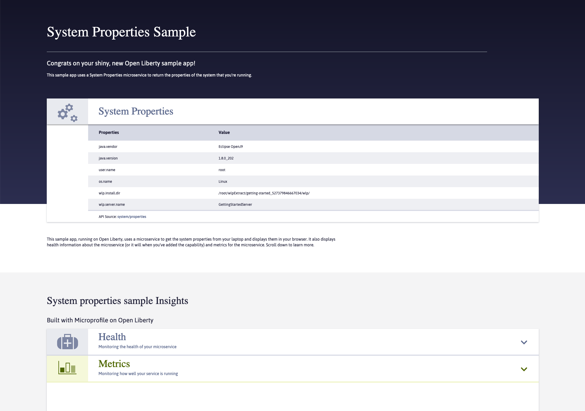

# Java + OpenLiberty Web Action Proxy Example

This example demonstrates how to run an existing Java web application (built using OpenLiberty) on Apache OpenWhisk with the Web Action Proxy.

These steps can be used to wrap other Java web applications. 

## example application

This is the example application that will be wrapped into a Docker image with the Web Action Proxy.

https://github.com/OpenLiberty/guide-getting-started



The web application renders HTML content for the home page (with JS, CSS and images files). It also exposes backend API services on the `/properties`, `/health` and `/metricsOverHTTP` endpoints.

## instructions

### clone project repo

```
git clone https://github.com/OpenLiberty/guide-getting-started
```

### modify the absolute url references

Replace the URLs referenced in `/finish/src/main/webapp/js/mpData.js` with the following values.

```diff
-    var url = "http://localhost:9080/metricsOverHTTP";
+    var url = "metricsOverHTTP";

-    var url = "http://localhost:9080/system/properties";
+    var url = "system/properties";

-    var url = "http://localhost:9080/health";
+    var url = "health";

-    var url = "http://localhost:9080/config";
+    var url = "config";
```

### build runnable jar

- From the `guide-getting-started/finish` directory, run the following command.

```
mvn install -P runnable-package
```

This generates a fat JAR containing the application and app server in `target/getting-started.jar`. 

### create docker build file assets

- Create a Dockerfile in the `guide-getting-started` directory with the following contents.

```
FROM adoptopenjdk/openjdk8-openj9

ADD finish/target/getting-started.jar /app/
ADD script.sh /app/
ADD proxy /app/

ENV PROXY_PORT 9080
ENV PROXY_ALIVE_PATH /js/mpData.js
ENV PROXY_ALIVE_DELAY 1000
EXPOSE 8080

WORKDIR /app
CMD ./script.sh
```

- Copy the `proxy` binary from the Web Action Proxy repo to the `guide-getting-started` directory.

- Create a `script.sh` file in the `guide-getting-started` directory with the following contents.

```bash
#!/bin/bash

./proxy & java -jar getting-started.jar
```

### docker build, tag and push!

- Build the Docker image for the example application.

```
 docker build -t openliberty .
```

- Tag the local image with the Docker Hub repo name.

```
 docker tag openliberty <USERNAME>/openliberty
```

- Push the local image to Docker Hub.

```
 docker push <USERNAME>/openliberty
```

### create web action

- Create the Apache OpenWhisk Web Action from the public Docker image.

```
wsk action create openliberty --docker <USERNAME>/openliberty --web true -m 512
```

### access web application

- Retrieve the Web Action URL for the `expressjs` action.

```
 wsk action get openliberty --url
```

- Open the Web Action URL (with a `/` appended to the action name) in a web browser, i.e.

```
https://<OW_HOST>/api/v1/web/<NAMESPACE>/default/openliberty/
```

**Important: Page links won't work unless the Web Action URL ends with a `/` after the action name.**


### be patient! 😄

Cold-start times for the Java + Liberty runtime are > 10 seconds. Initial requests may take a while but will eventually complete. Once the runtimes are warm, responses are under < 100ms.