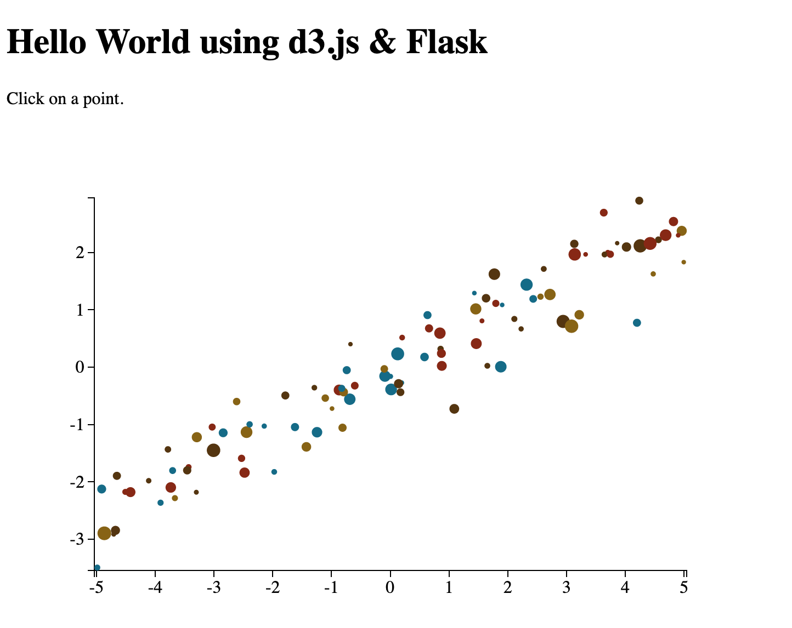

# Python + Flask Web Action Proxy Example

This example demonstrates how to run an existing Python web application (built using Flask) on Apache OpenWhisk with the Web Action Proxy.

These steps can be used to wrap other Python web applications. 

## example application

This is the example application that will be wrapped into a Docker image with the Web Action Proxy.

https://github.com/dfm/flask-d3-hello-world



The web application renders static HTML content for home page and a JSON API at the `/data` route. 

## instructions

### clone project repo and install modules

```
https://github.com/dfm/flask-d3-hello-world
```

### modify the app source code

Due to the limitations of the Web Action Proxy, the XHR URL for the backend must refer to relative locations, e.g.`data` rather than `/data`.

- Replace URL path in  `template/index.html`

```diff
-        d3.json("/data", callback);
+        d3.json("data", callback);
```

- Change `app.py` to make it suitable for the platform.

```diff
-import json
+from flask import jsonify

-    return json.dumps([{"_id": i, "x": x[i], "y": y[i], "area": A[i],
+    return jsonify([{"_id": i, "x": x[i], "y": y[i], "area": A[i],

-    os.system("open http://localhost:{0}".format(port))

-    app.debug = True
```

### create docker build file assets

- Create a Dockerfile in the parent directory to the` flask-d3-hello-world` with the following contents.

```
FROM node:10

ADD flask-d3-hello-world /app/
ADD script.sh /app/
ADD proxy /app/

RUN curl https://bootstrap.pypa.io/get-pip.py -o get-pip.py
RUN python3 get-pip.py
RUN pip install numpy flask

ENV PROXY_PORT 8000
EXPOSE 8080

WORKDIR /app
CMD ./script.sh
```

- Copy the `proxy` binary from the Web Action Proxy repo to the parent directory of `flask-d3-hello-world`.

- Create a `script.sh` file in the parent directory to the `flask-d3-hello-world` with the following contents.

```bash
#!/bin/bash

./proxy & python3 app.py
```

### docker build, tag and push!

- Build the Docker image for the example application.

```
 docker build -t flask .
```

- Tag the local image with the Docker Hub repo name.

```
 docker tag flask <USERNAME>/flask
```

- Push the local image to Docker Hub.

```
 docker push <USERNAME>/flask
```

### create web action

- Create the Apache OpenWhisk Web Action from the public Docker image.

```
wsk action create flask --docker <USERNAME>/flask --web true
```

### access web application

- Retrieve the Web Action URL for the `expressjs` action.

```
 wsk action get flask --url
```

- Open the Web Action URL (with a `/` appended to the action name) in a web browser, i.e.

```
https://<OW_HOST>/api/v1/web/<NAMESPACE>/default/flask/
```

**Important: Page links won't work unless the Web Action URL ends with a `/` after the action name.**

